<div align="center">

# 🐾 DeskBuddy

### 바탕화면에 사는 작은 친구, 오늘의 일을 함께하는 모험

일정을 퀘스트로 바꾸고, 집중해서 코인을 모으고,<br>
잠깐 쉬어갈 땐 친구와 배구 한 판 — 또는 마법의 성으로!

**Windows 10 / 11 · C# · .NET Framework 4.x · 픽셀 UI**

[시작하기](#시작하기) · [기능 둘러보기](#기능-둘러보기) · [미니게임](#미니게임) · [개발 안내](#개발-안내)

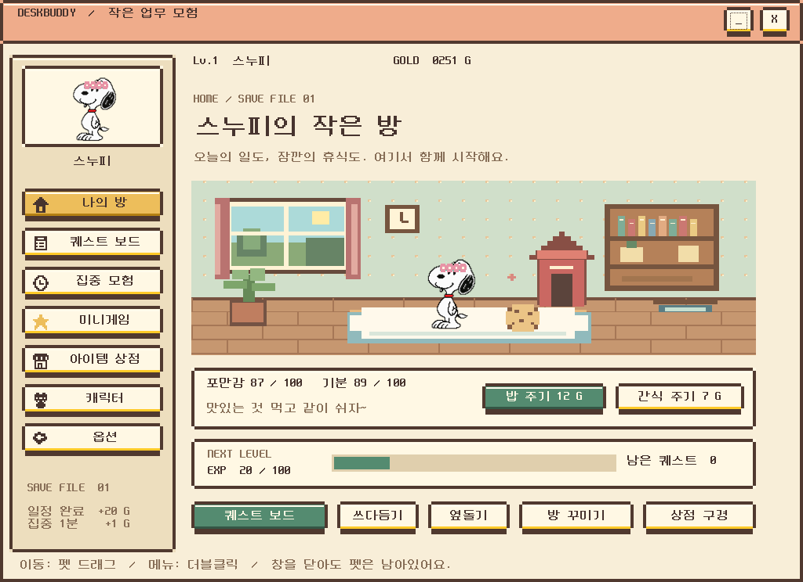

*작은 완료 하나가 쌓여, 친구와 함께하는 하루가 됩니다.*

</div>

---

## 시작하기

1. 다운로드한 ZIP이 있다면 **전체 압축을 먼저 해제**하세요.
2. 프로젝트 폴더의 **`DeskBuddy-START.cmd`를 더블클릭**하세요. `dist/DeskBuddy.exe`로도 실행할 수 있습니다.
3. 바탕화면의 친구를 더블클릭하면 메뉴가 열립니다. 일정을 등록하거나 마음에 드는 캐릭터부터 골라보세요!

Python, Node.js 설치나 계정 가입 없이 실행합니다. Windows 10/11과 .NET Framework 4.x가 필요합니다.

| 하고 싶은 일 | 이렇게 해요 |
| :--- | :--- |
| 메뉴 열기 | 펫 **더블클릭** 또는 작업 표시줄의 DeskBuddy 아이콘 더블클릭 |
| 펫 위치 바꾸기 | 펫을 **드래그** |
| 빠른 메뉴 / 게임 열기 | 펫 **우클릭** |
| 친구와 놀기 | 나의 방에서 **쓰다듬기 / 옆돌기** |
| 완전히 종료하기 | 펫 우클릭 → **종료**, 또는 옵션의 종료 |

> **창의 X는 메뉴만 닫습니다.** 이미 실행 중일 때 다시 실행하면 기존 메뉴가 열립니다. 업데이트 후에는 펫 우클릭 → 종료한 뒤 다시 실행해야 새 버전이 적용됩니다.

## 기능 둘러보기

### 📋 할 일을 퀘스트로

회의, 출근, 퇴근, 휴가까지 한곳에서 관리하세요. 일반 일정을 완료하면 **20코인과 20 EXP**를 받습니다. 바쁠 때는 10분 뒤 다시 알릴 수 있어요.

**야근은 쉬어야 한다는 작은 신호!** 야근 분류를 선택하거나 제목에 '야근'을 넣으면 완료 버튼이 **야근 완료 -20 코인**으로 바뀝니다. 완료할 때 20코인을 차감하고, 잔액이 부족하면 0코인까지 차감합니다. 같은 회차의 완료를 다시 눌러도 중복 차감하지 않습니다. 야근 빠른 등록은 기본 종료 시각을 21:00으로 설정합니다.

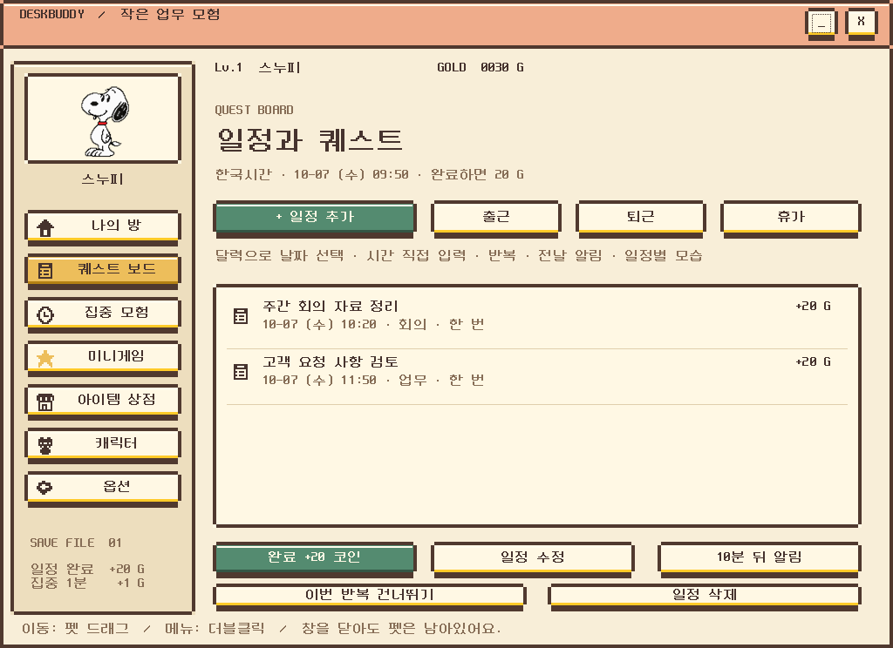

<details>
<summary><b>반복 일정과 전날 알림도 설정할 수 있어요</b></summary>

달력에서 날짜를 고르고 시간은 `09:00`처럼 입력하거나 15분 간격 목록에서 선택합니다. 일정과 알림, 집중 타이머는 **한국시간**을 사용합니다.

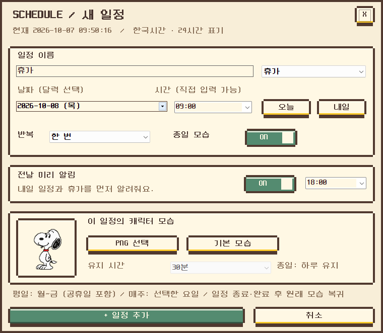

- **반복:** 한 번 / 매일 / 평일 / 매주. 평일은 월~금이며 공휴일도 포함합니다.
- **빠른 등록:** 출근은 평일 09:00, 퇴근은 평일 18:00으로 미리 설정됩니다.
- **휴가:** 내일 09:00, 종일 모습, 전날 18:00 알림을 미리 선택합니다.
- **전날 알림:** 원하는 시각에 내일의 일정을 미리 알려줍니다.
- **일정별 모습:** PNG를 지정하면 당일 알림부터 30분 / 1시간 / 2시간 동안, 또는 종일 캐릭터가 바뀝니다. 전날 알림에도 잠깐 표시됩니다.

반복 일정은 완료하면 다음 회차로 넘어가며, 건너뛰기는 보상 없이 다음 회차로 이동합니다. 겹친 모습은 종일 일정과 가장 최근 시작 일정을 우선하고, 지정 시간이 끝나면 원래 캐릭터로 돌아갑니다.

알림은 앱이 실행 중일 때 동작합니다. 절전 복귀나 재실행 시 놓친 미완료 일정은 한 번 알리며, Windows 알림 표시 여부는 OS 설정의 영향을 받습니다.

</details>

### ⏳ 집중할수록 함께 성장

집중 시간을 **1~120분**으로 정하고 나만의 집중 모험을 시작하세요. 완료하면 **1분당 1코인과 1 EXP**를 받습니다. 업무·집중·교감으로 모은 EXP가 100씩 쌓일 때마다 표시 레벨이 올라갑니다.

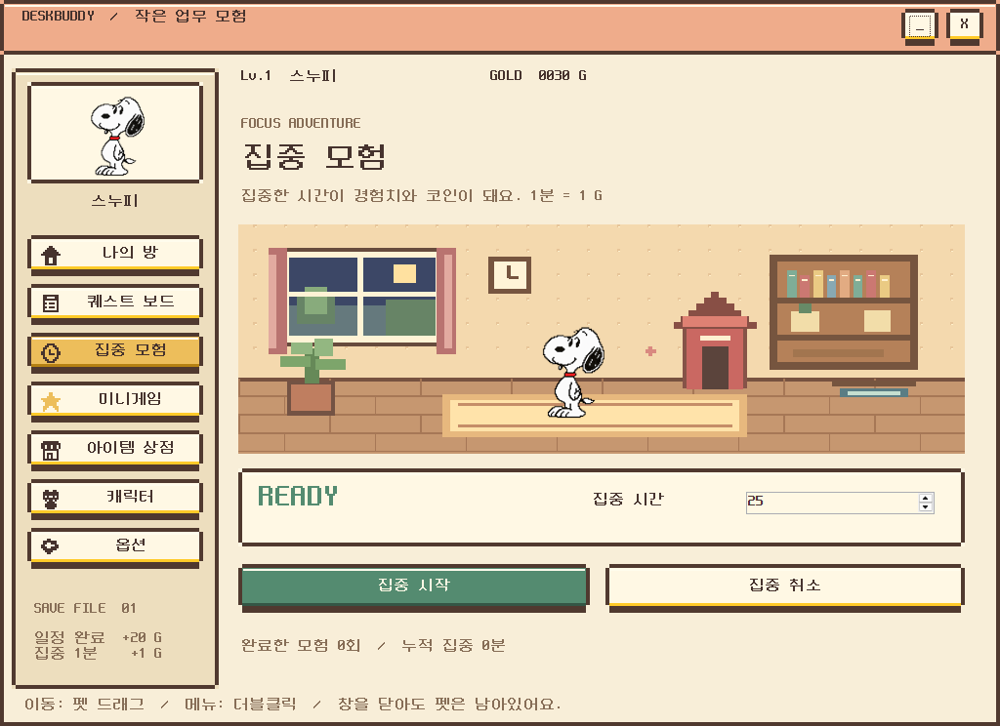

집중 중에는 펫의 산책이 멈추고 게임을 시작할 수 없습니다. 타이머는 저장된 종료 시각을 기준으로 계산하므로 앱 종료나 절전 중에 경과한 시간도 포함합니다.

### 🎨 내가 고른 친구와 함께

기본 스누피부터 가나디, 메타몽, 루피, 햄뿡이, 찌오까지 **6개 캐릭터**를 골라보세요. 내 이미지도 불러오거나 샘플 목록에 여러 개 추가할 수 있습니다.

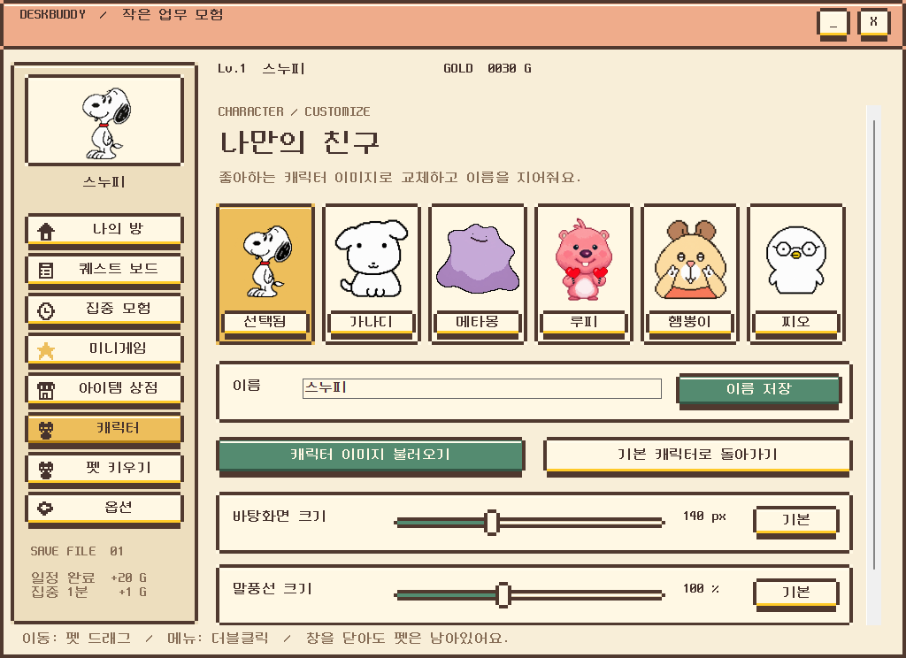

- **이름:** 이름 저장 또는 Enter로 적용됩니다. 기본 캐릭터를 선택하면 해당 캐릭터 이름으로 바뀝니다. 선택 후 원하는 이름으로 다시 바꿀 수 있고, 직접 추가한 이미지를 선택할 때는 이름이 유지됩니다.
- **말풍선:** 캐릭터 화면의 크기 설정 아래에서 **60~160%**로 조절합니다. 일정 알림과 일반 대화의 말풍선·글자가 함께 바뀌며 설정이 저장됩니다. 옆의 **미리보기**를 열면 예시 말풍선과 캐릭터를 실제 크기로 보면서 두 크기를 함께 조절할 수 있습니다.
- **크기:** 슬라이더로 바탕화면 크기를 **40~320px** 사이에서 즉시 조절합니다. 기본 크기는 140px입니다.
- **옆돌기:** 나의 방 버튼이나 우클릭으로 실행하세요. 산책 중에도 가끔 회전하며 이동합니다. 자동 옆돌기는 우클릭에서 켜고 끕니다.
- **내 이미지:** PNG / JPG / BMP, 10MB 이하, 가로·세로 각각 4096px 이하를 지원합니다. 원본 비율과 PNG 투명도를 유지합니다.

기본 이미지 6개는 실행파일에 포함되어 있습니다. 옆돌기는 원본 이미지를 회전하는 동작이며, 드래그·집중·게임 중에는 멈춥니다. JPG 배경 제거와 작은 원본의 디테일 생성 기능은 포함되어 있지 않습니다.

### 🥚 레벨 2부터 작은 펫 키우기

왼쪽 **펫 키우기**에서 알을 무료로 입양하세요. 캐릭터마다 별도의 펫을 키우며, 알도 캐릭터 옆에서 함께 산책합니다. 캐릭터를 바꿨다가 돌아와도 성장 기록은 유지됩니다. 레벨이 1로 내려가면 알과 펫이 숨겨지고 돌봄도 잠깁니다. 다시 레벨 2가 되면 기존 성장 상태로 이어서 키울 수 있습니다.

- **알 → 아기 → 성체:** 돌봄 3회에 부화, 총 10회에 성장 완료.
- **돌봄 비용:** 보살피기·놀아주기 5 G, 영양·밥 주기 8 G. 돌봄은 펫마다 1분에 한 번 가능합니다.
- **성장 후:** 계속 돌보면 친밀도가 올라갑니다.
- **찌오의 펫:** 둥근 몸, 노란 부리와 반짝임이 있는 픽셀 새로 자랍니다.


### 🎁 모은 코인으로 꾸미기

작은 백화점에는 **캐릭터 꾸미기 14종 · 방 꾸미기 14종 · 음식 6종**이 준비돼 있습니다. 캐릭터 꾸미기에는 리본, 별빛 모자, 왕관, 안경, 꽃 화관, 목도리, 토끼 머리띠, 날개, 헤드폰 등이 있습니다. 구매한 아이템은 추가 비용 없이 다시 장착할 수 있습니다. 각 품목에는 미리보기와 설명, 가격이 표시됩니다.

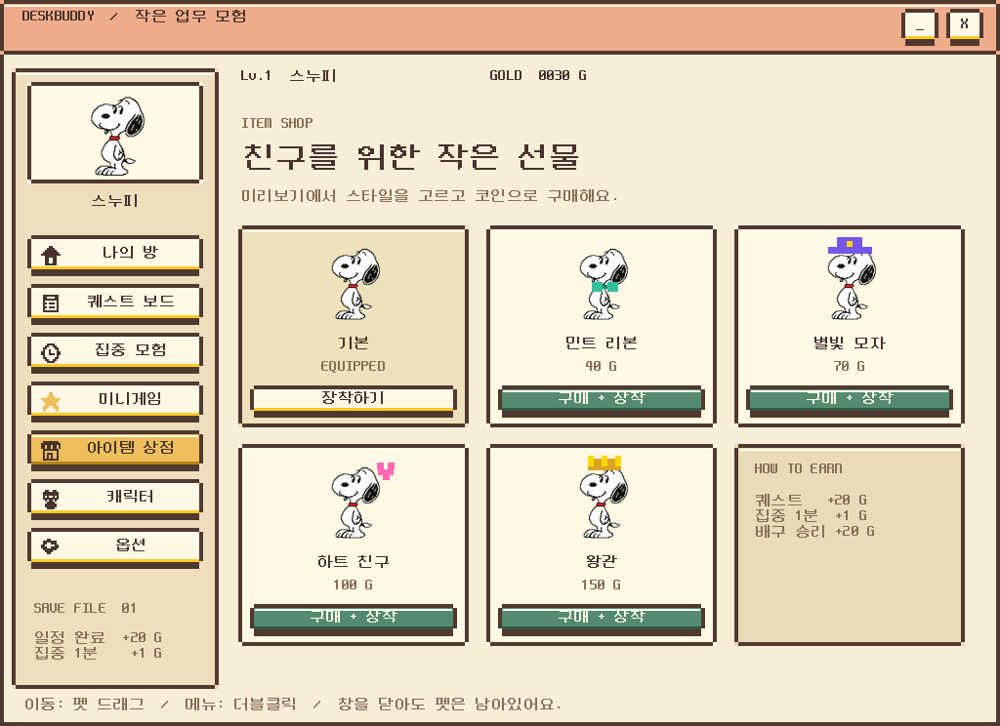

액세서리는 고정 위치에 표시되므로 선택한 이미지의 모양에 따라 위치가 다르게 보일 수 있습니다.

### 🪴 우리 방도 예쁘게

나의 방의 **방 꾸미기** 버튼 또는 상점의 **방 꾸미기** 탭에서 골라보세요. 벽지·러그·장식은 각자 하나씩 선택해 함께 사용할 수 있습니다. 홈과 집중 화면에도 적용되고, 재실행 후에도 유지됩니다.

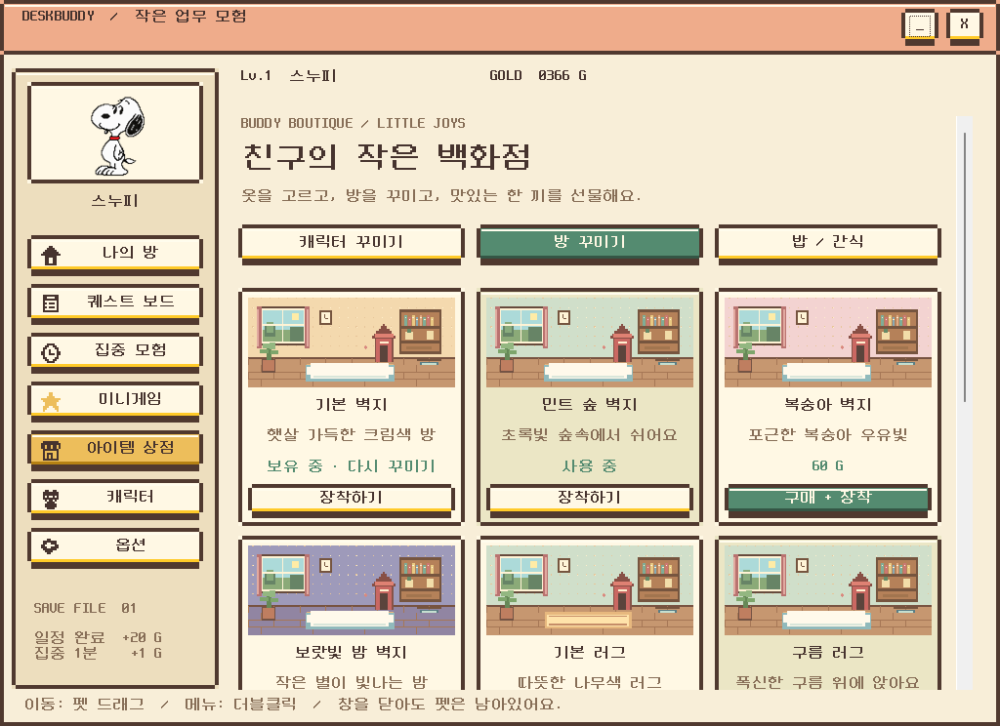

| 종류 | 고를 수 있는 스타일 |
| :--- | :--- |
| 벽지 | 기본 / 민트 숲 / 복숭아 / 보랏빛 밤 |
| 러그 | 기본 / 구름 / 별무늬 / 딸기 |
| 장식 | 기본 / 꽃 화분 / 별빛 조명 / 작은 수족관 |

기본 품목은 무료이며, 구매한 방 아이템은 다시 사용할 때 코인이 들지 않습니다.

### 🍓 밥도 먹고, 간식도 먹고

홈의 **밥 주기 / 간식 주기**, 펫 우클릭, 또는 상점의 **밥 / 간식** 탭에서 먹일 수 있습니다. 먹을 때마다 코인을 사용하며 포만감과 기분이 올라갑니다. 음식은 먹으면 소모되고, 짧게 음식 그림과 '냠냠!' 인사를 보여줍니다.

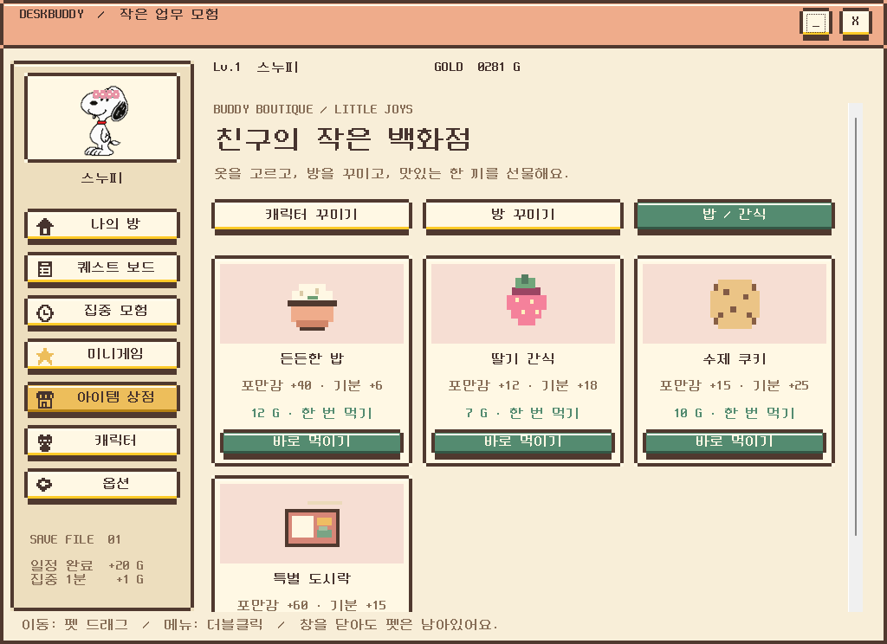

| 음식 | 가격 | 포만감 | 기분 |
| :--- | :---: | :---: | :---: |
| 든든한 밥 | 12 G | +40 | +6 |
| 딸기 간식 | 7 G | +12 | +18 |
| 수제 쿠키 | 10 G | +15 | +25 |
| 특별 도시락 | 20 G | +60 | +15 |

포만감과 기분은 최대 100입니다. 둘 다 가득 차 있으면 먹이기에 코인을 쓰지 않습니다. 한 시간마다 포만감은 6, 기분은 3씩 줄며, 종료 중에 지난 시간도 다음 실행 때 반영합니다. 상태와 구매 기록은 자동 저장됩니다.

## 미니게임

일을 끝냈다면 잠깐 한 판! 메뉴의 **미니게임** 또는 펫 우클릭에서 시작할 수 있습니다. 게임 중에는 메뉴와 바탕화면 펫이 잠시 숨겨지고, 게임을 닫으면 다시 돌아옵니다.

### 🏐 바탕화면 배구

내 캐릭터로 컴퓨터 친구와 대결하세요. **먼저 5점을 얻으면 승리!** 점프해서 공을 받아내고 스매시로 득점을 노려보세요. 코트의 빈 부분에는 실제 바탕화면이 비칩니다.

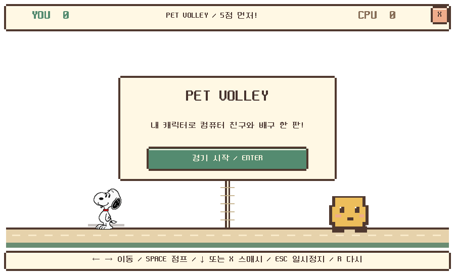

| 조작 | 키 |
| :--- | :--- |
| 시작 / 계속 | Enter 또는 시작 버튼 |
| 좌우 이동 | ← → 또는 A / D |
| 점프 | Space / ↑ / W |
| 스매시 | ↓ / X |
| 일시정지 | Esc / P |
| 새 경기 | R |

**승리 +20코인 · 패배 +5코인.** 상단 점수판을 드래그하면 코트 위치를 옮길 수 있습니다. 다른 앱으로 전환하면 자동 정지하며, 코트로 돌아와 Enter를 누르면 이어서 플레이합니다.

### 🏰 마법의 성 — 3탄 모험

발판을 올라가 **별 3개를 모으고 꼭대기의 문에 도착**하세요. 한 탄을 깨면 Enter 또는 다음 탄 시작 버튼으로 이어갑니다. **3탄까지 모두 클리어하면 50코인!**

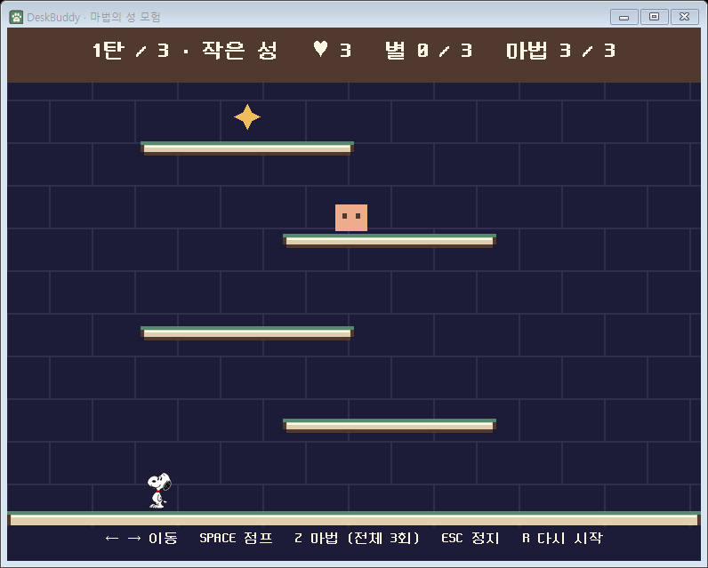

| 단계 | 맵 | 기다리는 도전 |
| :---: | :--- | :--- |
| **1탄** | 작은 성 | 넓은 발판에서 점프와 마법 익히기 |
| **2탄** | 바람의 탑 | 좁아진 발판, 더 많고 빠른 몬스터 |
| **3탄** | 어둠의 성 | 더 좁고 엇갈린 발판, 빠른 몬스터와 두 번 공격해야 하는 보라색 몬스터 |

<details>
<summary><b>2탄과 3탄 화면도 구경하기</b></summary>

**2탄 · 바람의 탑**

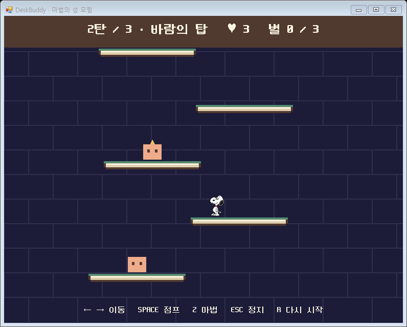

**3탄 · 어둠의 성**

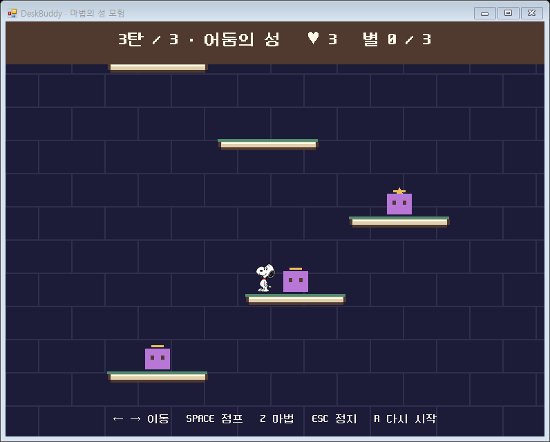

</details>

| 조작 | 키 |
| :--- | :--- |
| 시작 / 계속 / 다음 탄 | Enter 또는 중앙 버튼 |
| 좌우 이동 | ← → 또는 A / D |
| 점프 | Space / ↑ / W |
| 마법 공격 (1~3탄 합쳐 총 3회) | Z / X |
| 일시정지 | Esc / P |
| 1탄부터 다시 도전 | R |

마법은 한 게임 전체에서 총 3번만 사용할 수 있으며 탄이 바뀌어도 충전되지 않습니다. 키를 길게 눌러도 한 번만 사용하고, R로 새 게임을 시작하면 3회로 돌아옵니다. 매 탄 시작할 때 생명이 3개로 회복됩니다. 몬스터에 닿으면 생명이 줄고 잠깐 무적이 됩니다. 생명을 모두 잃으면 실패하며 1탄부터 다시 도전합니다. 1·2탄에는 중간 보상이 없고, 최종 클리어 시 **+50코인**, 실패 시 **+5코인**을 받습니다.

### 💩 하늘에서 똥 피하기

화살표 네 방향으로 움직이며 하늘에서 떨어지는 똥을 피하세요. **1탄 20초 → 2탄 25초 → 3탄 30초**를 버티면 **50코인**을 받습니다. 단계마다 낙하 속도와 수가 늘고 생명은 3개로 회복됩니다. Enter로 다음 탄, Esc/P로 정지, R로 처음부터 다시 도전합니다.

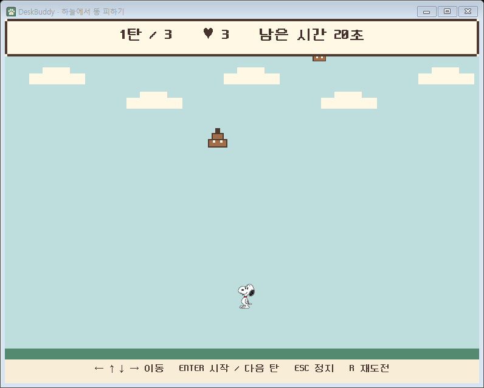

> **게임 보상은 배구·성 모험·똥 피하기 합산 하루 3회**입니다. 이후에도 보상 없이 플레이할 수 있으며, 중도 종료에는 보상이 없습니다. 모든 게임은 집중 중에는 시작할 수 없습니다.

## 보상 한눈에 보기

| 활동 | 코인 | EXP |
| :--- | :---: | :---: |
| 일정 완료 | +20 | +20 |
| 야근 일정 완료 | -20 (잔액 최저 0) | +20 |
| 집중 완료 | 1분당 +1 | 1분당 +1 |
| 배구 승리 / 패배 | +20 / +5 | — |
| 마법의 성 3탄까지 완료 / 실패 | +50 / +5 | — |

## 저장과 문제 해결

<details>
<summary><b>저장 위치와 백업</b></summary>

일정·이름·이미지 선택·추가 샘플 목록·코인·크기·집중 종료 시각·꾸미기·방 아이템·포만감·기분·먹이기 기록은 아래 파일에 저장됩니다.

```text
%LOCALAPPDATA%\DeskBuddy\data.json
```

이전 저장은 `data.json.bak`, 손상된 원본은 `.damaged-*`로 보관합니다. 가져온 캐릭터와 일정 이미지는 같은 폴더에 복사합니다. 옵션의 백업은 JSON을 내보내므로 **이미지 파일도 따로 보관**하세요. 자동 복원 UI는 없습니다.

</details>

<details>
<summary><b>창이 안 보이거나 업데이트가 적용되지 않을 때</b></summary>

- 작업 표시줄의 숨겨진 아이콘 **(^) → DeskBuddy 더블클릭**으로 메뉴를 엽니다.
- 메뉴 창의 X를 눌러도 앱은 계속 실행됩니다. 업데이트 후에는 **펫 우클릭 → 종료 → 다시 실행**하세요.
- ZIP 안에서 바로 실행하지 말고 전체 압축을 해제한 뒤 `DeskBuddy-START.cmd`를 실행하세요.
- 시작 오류 기록은 `%LOCALAPPDATA%\DeskBuddy\startup.log`에서 확인할 수 있습니다.

</details>

## 개발 안내

<details>
<summary><b>빌드, 검증 명령과 소스 구성</b></summary>

Windows PowerShell에서 프로젝트 폴더로 이동한 뒤 실행합니다.

```powershell
powershell -NoProfile -ExecutionPolicy Bypass -File .\build.ps1 -Test -Preview
```

실행 중인 앱이 있다면 먼저 종료하세요. 빌드 결과는 `dist/DeskBuddy.exe`, 샘플 화면은 `dist/preview`에 생성됩니다. README의 스크린샷은 버전 관리되는 [`docs/screenshots`](docs/screenshots)에 보관합니다. 화면은 샘플 데이터와 게임 상태로 생성했습니다.

| 파일 | 담당 기능 |
| :--- | :--- |
| [DeskBuddy.cs](DeskBuddy.cs) | 저장, 보상, 이미지 렌더링, 바탕화면 펫 |
| [PixelUI.cs](PixelUI.cs) | 픽셀 UI, 방, 캐릭터 선택, 크기 슬라이더, 메뉴 |
| [ScheduleCore.cs](ScheduleCore.cs) / [ScheduleEditor.cs](ScheduleEditor.cs) | 한국시간 일정, 반복, 알림, 일정 편집 |
| [Volleyball.cs](Volleyball.cs) | 배구 물리, AI, 득점과 키 조작 |
| [Castle.cs](Castle.cs) | 성 모험 3탄, 점프, 공격, 수집과 보상 |
| [CharacterLibrary.cs](CharacterLibrary.cs) | 내장 캐릭터와 추가 샘플 목록 |
| [Living.cs](Living.cs) | 상점 품목, 방 꾸미기, 먹이기와 상태 변화 |
| [AlphaWindow.cs](AlphaWindow.cs) | 픽셀별 알파 합성으로 투명 창 표시 |

| 실행 인자 | 확인하는 내용 |
| :--- | :--- |
| `--self-test` | 업무·집중·상점·게임 보상과 물리 규칙 |
| `--ui-test` | 메뉴 버튼, 이름·이미지 선택, 크기와 설정 저장 |
| `--volley-test` | 배구 물리, 득점, 보상, 창의 키 조작과 정지·재개 |
| `--castle-test` | 3탄 진행, 점프 경로, 공격, 보상 저장과 창의 키 조작 |
| `--living-test` | 실제 메뉴의 먹이기·방 구매·재장착·야근 완료 차감과 저장 |
| `--image-test 이미지경로` | 원본 비율, 투명도, 좌우 방향 유지와 렌더링 |
| `--preview` | 샘플 데이터로 메뉴 스크린샷 생성 |

테스트는 별도 임시 데이터를 사용합니다. 키 조작 검사는 창 이벤트에 테스트 입력을 전달하며 전역 키보드 입력을 보내지 않습니다. Windows 알림, 화면 배율, 여러 모니터와 절전 복귀의 실제 사용성은 수동 확인이 필요합니다. 검증 기록은 [검증결과.md](검증결과.md)에 정리합니다.

</details>

## 사용한 리소스

- **픽셀 글꼴:** [Neo둥근모](https://github.com/neodgm/neodgm-webfont), SIL OFL 1.1. [라이선스 전문](assets/FONT-LICENSE.txt).
- **달력:** [ComponentFactory Krypton Toolkit](https://github.com/ComponentFactory/Krypton) 4.6, BSD 3-Clause. [라이선스 전문](lib/KRYPTON-LICENSE.txt).
- **캐릭터:** [`img/Character`](img/Character)의 제공된 PNG 원본. 기본 캐릭터는 `jiyoung_ch.png`입니다. 공개 배포·제품화에는 사용 권한을 확인하거나 자체 캐릭터를 사용하세요.

---

<div align="center">

**오늘의 퀘스트를 마치고, 친구에게 작은 선물 하나. 🐾**

</div>

### 관리자 테스트 설정
옵션 화면 아래의 관리자 설정에서 첫 비밀번호를 직접 만들고 로그인하세요. 레벨을 1~100으로 조정해 펫 기능을 시험할 수 있으며 업무·집중·교감 기록은 유지됩니다. 원래 경험치로 돌아가기 버튼으로 조정을 해제합니다. 비밀번호는 별도의 이 PC 설정에 솔트와 PBKDF2 해시로 저장되고 공유 ZIP 및 데이터 백업에 포함되지 않습니다. 창을 닫으면 로그아웃됩니다.
PC별 비밀번호는 중앙 사용자 권한 관리가 아닙니다. 여러 PC에서 특정 계정만 관리자 권한을 주려면 서버 로그인과 서버 측 권한 확인이 필요합니다.

### 레벨마다 열리는 새로운 모험

| 레벨 | 열리는 기능 |
| --- | --- |
| 2 | 캐릭터별 알 입양·펫 키우기·똥 피하기 |
| 3 | 무료 댄스·공중제비 액션, 마법의 성 4·5탄 |
| 4 | 축제 리본(100 G)·축제 벽지(110 G) 구매 |
| 5 | 펫과 함께 놀기: 1분마다 무료로 친밀도 +1 |
| 7 | 방과 바탕화면의 별빛 효과 |
| 10 | 전설 왕관(250 G)·왕실 벽지(220 G) 구매, 전설의 친구 칭호 |

레벨업 시 별빛 축하 연출과 새로 열린 기능 안내가 나옵니다. 기존 레벨로 재실행할 때는 안내가 반복되지 않습니다. 관리자 설정으로 레벨을 내리면 액션·펫·장비·벽지·효과가 다시 잠기지만 보유 아이템과 펫 기록은 유지됩니다.


### 추가 성 모험과 스누피의 성체 펫
레벨 3부터 미니게임의 마법의 성 4·5탄 버튼으로 폭풍의 성과 황금 마법탑에 도전할 수 있습니다. 좁은 발판과 빠른 갑옷 몬스터를 지나 두 탄을 연속 완주하면 100코인을 받습니다. 추가 코스에서도 마법은 합쳐 3회이며 하루 게임 보상 횟수를 공유합니다. 기본 1~3탄의 50코인 코스는 유지됩니다.
똥 피하기는 레벨 2부터 시작할 수 있습니다. 스누피 펫의 성체는 노란 새 우드스탁으로 바뀌며 기존 성장 기록은 유지됩니다.

### 상점의 레벨별 구매 해금

| 레벨 | 새로 구매할 수 있는 품목 |
| --- | --- |
| 1 | 민트 리본, 기본 방 꾸미기, 든든한 밥·딸기 간식 |
| 2 | 딸기 리본, 꽃 화분, 민트 숲·복숭아 벽지 |
| 3 | 둥근 안경, 구름 러그, 수제 쿠키 |
| 4 | 별빛 모자·꽃 화관·축제 리본, 축제 벽지, 과일 한 접시 |
| 5 | 하트 친구·목도리·헤드폰, 별무늬·딸기 러그, 보랏빛 밤 벽지·별빛 조명 |
| 7 | 토끼 머리띠·별빛 날개, 작은 수족관, 특별 도시락 |
| 10 | 왕관·전설 왕관, 왕실 벽지, 왕실 만찬 |

상점에는 모든 품목을 미리 보여주며, 잠긴 품목에는 필요한 레벨을 표시합니다. 낮은 레벨부터 정렬되고, 레벨업 안내에도 새로 열린 품목이 나옵니다. 레벨을 내리면 구매·먹이기·장착이 다시 잠기지만 보유 기록은 유지됩니다.
작은 펫은 바탕화면과 방에서 본 캐릭터 크기의 약 1/3로 표시됩니다. 바탕화면 캐릭터 크기를 변경하면 펫도 비례해 조절됩니다. 성체는 직접 성장시켜 발견해주세요.

### 구글 캘린더 연결

설정 → 구글 캘린더 연결에서 구글 캘린더의 **iCal 형식의 비공개 주소**를 입력하세요. 주소는 구글 캘린더 설정 → 내 캘린더 선택 → 캘린더 통합에서 확인할 수 있습니다.

약 15분마다 최근 하루와 앞으로 90일의 일정을 가져옵니다. 일정 변경은 구글에서 하고, 완료와 알림은 DeskBuddy에서 사용할 수 있습니다. 기본 일간·주간·월간·연간 반복, 제외 날짜와 개별 일정 변경을 처리하며 지원하지 않는 반복 형식이나 시간대가 있으면 기존 일정을 유지하고 갱신을 중단합니다.

주소는 Windows 사용자 계정에 묶어 암호화한 별도 파일에 저장되며 데이터 백업에 포함되지 않습니다. 연결 해제는 가져온 일정만 제거하고 구글 원본을 유지합니다. 비공개 주소는 다른 사람에게 공유하지 마세요.

### 일정 달력

퀘스트 보드의 **달력 보기**를 누르면 월별 달력이 열립니다. 날짜를 선택해 오른쪽에서 일정을 확인하고 선택한 날짜에 새 일정을 등록하세요. 이전/다음 달 이동과 오늘로 돌아가기를 지원하며, 구글 일정과 반복 예정 일정도 함께 표시합니다. 일정 시간이 지난 실제 일정은 완료할 수 있고, 반복 예정일은 완료되지 않습니다.

### 바탕화면 집중 타이머

집중 모험을 시작하면 캐릭터 머리 위에 남은 시간이 표시되고, 완료하거나 취소하면 사라집니다. 캐릭터 설정의 **집중 타이머**에서 크기를 60~180%로 조절할 수 있습니다. 미리보기에서 캐릭터·말풍선·타이머 크기를 함께 확인하세요.

### 일정 시간 범위

일정 등록에서 시작 시간과 종료 시간을 지정하세요(예: 14:00~15:30). 자정을 넘으면 **다음날 종료**를 켜고, 하루 전체 일정은 **종일 일정**을 선택하세요. 퀘스트 보드와 달력에 시간 범위를 표시하며, 반복 일정은 같은 길이를 유지합니다. 구글 캘린더의 종료 시간도 가져옵니다. 기존 시각 일정은 그대로 읽을 수 있습니다.

### 머리 위 메모

왼쪽 퀘스트 보드 아래의 **메모관리**에서 메모를 등록·수정·삭제하세요. 여러 메모를 보관하고 **캐릭터 머리 위에 표시**를 체크한 메모만 항상 띄웁니다. 표시 가능한 메모는 최대 3개이며, 기존 메모 표시를 끄면 다른 메모를 띄울 수 있습니다.

일정 말풍선 → 메모 → 집중 타이머 → 캐릭터 순서로 별도 공간을 사용합니다. 긴 메모는 머리 위에서 일부만 표시하며 설정에서 전체 내용을 확인할 수 있습니다. 메모는 이 PC에 저장되고 백업에도 포함됩니다.

### 교감 경험치

쓰다듬기(방의 캐릭터 클릭 포함), 직접 시키는 옆돌기·댄스·공중제비·함께 놀기로 **5 EXP**를 얻습니다. 모든 교감 행동이 **30초 대기시간을 공유**하며 경험치와 대기시간은 저장됩니다. 산책 중 자동 옆돌기는 경험치를 주지 않습니다. 관리자 레벨 조정을 해제해도 실제로 얻은 교감 경험치는 남습니다.
